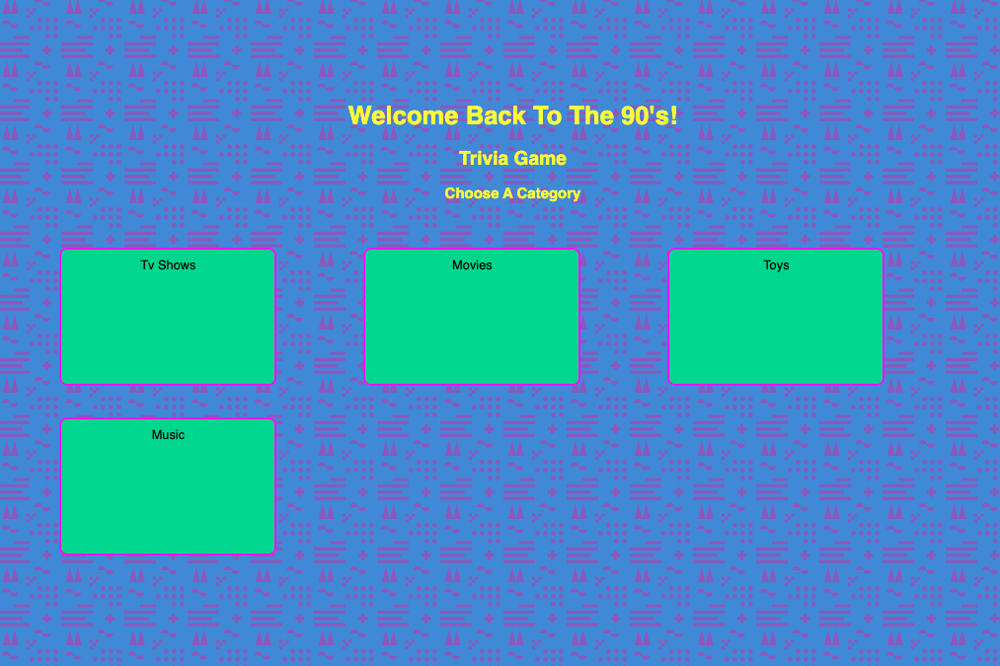
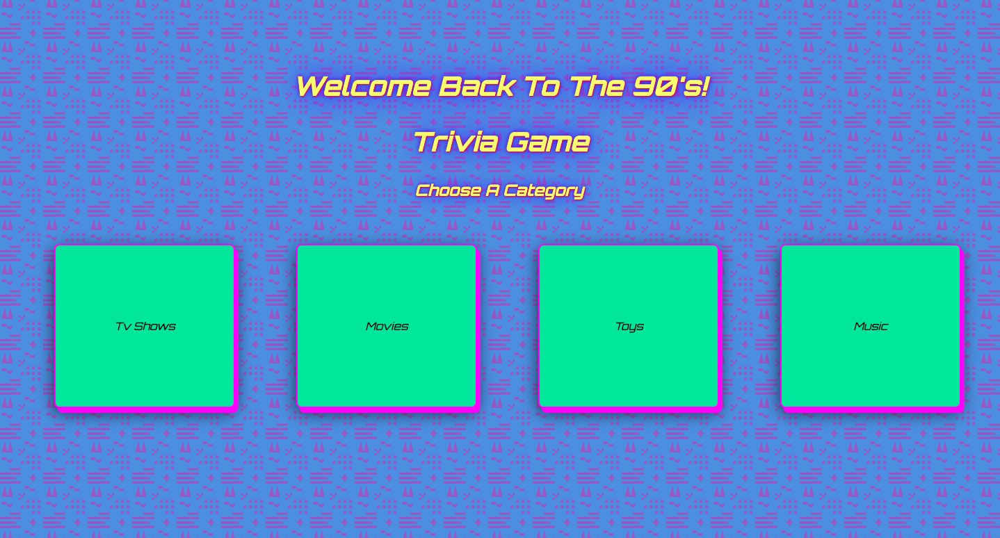

<!-- - **Screenshot:** A screenshot of your game.
- **Your game’s title**: A description of your game. Background info about why you chose the game is a nice touch.
- **Getting Started**: Include a link to your deployed game and any instructions you deem important.
- **Attributions**: Include links to any external resources (such as libraries or assets) you used to develop your application.
- **Technologies Used**: List of the technologies used, for example: JavaScript, HTML, CSS, etc.
- **Next Steps**: Planned future enhancements (icebox items).
- Your **`README.md`** file must be grammatically correct and free of spelling errors. -->

# `90's Trivia Quiz`

### `Description:`

###### `Welcome back to the 90's. 90's Trivia Quiz Game is a game that takes you back to some of your favorite tv shows, movies, toys, and music. The category cards can be clicked, which will then display questions related to that category. You can test your knowledge of the 90's by answering as many questions as you can  correctly before the time runs out. I chose this game to take everyone on a journey back to the 90's where some of the best music, tv shows, toys, and movies brought us some of the best memories.`

### `Play the game here:`

[90's Trivia Quiz Game](https://90striviaquizgame.netlify.app/)

### `Planning Materials:`

[Planning Materials](https://docs.google.com/document/d/1ehHp7F168ZOgbCp4YLXeWj69-Je3f7CJAkIs_uhyI3I/edit?usp=sharing)

| `Technology:`  | `Attributes:`   | `Icebox Items:`  |
| ------------- |:-------------:| -----:|
| `JavaScript`  | [Coolors](https://coolors.co/)   | `Scoring Functionality` |
| `HTML `       | [Hero Patterns](https://heropatterns.com/)| `Question cards and reset button aligned center during game`   | 
| `CSS`         | [Superfffmk.life](https://superfffmk.life/product_details/75046559.html)| `Animations added to header`   |
|               | [Orbitron Google Font](https://superfffmk.life/product_details/75046559.html)| `Sounds added when category card is clicked and when game has been won or lost`   |
|               | [Pixabay](https://pixabay.com/sound-effects/search/retro%20games/)   | |

